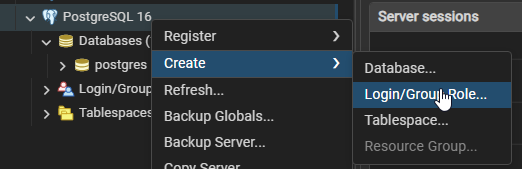
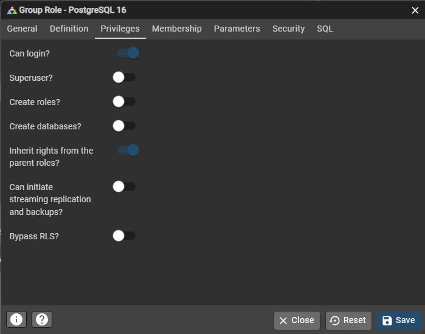
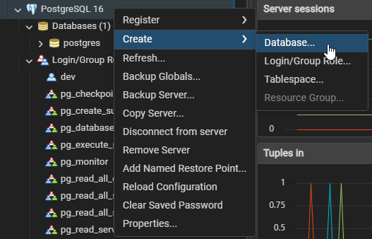
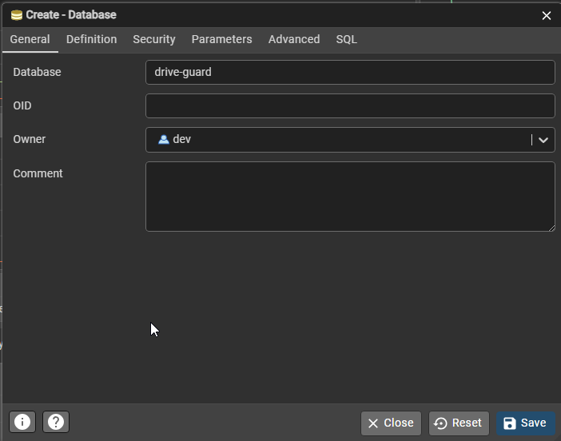
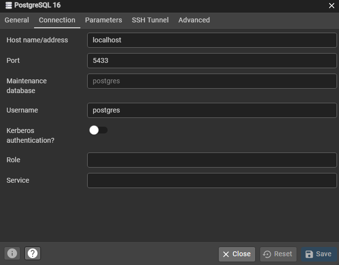

### Install
Install [postgresql 16](https://sbp.enterprisedb.com/getfile.jsp?fileid=1259129)

### User setup
Go into pgAdmin 4 application. Add a new user

Set a name under general (eg. "dev") and a password under definition.

Make sure the user has "can login?" permissions.

### Database setup
Add a new database (right click on PostgreSQL Databases -> Create -> Database)

Give it a name and set the owner to the user you created earlier.

Note the hostname and port for later. You can find these by right-clicking on the server and selecting properties.

Note:
Whenever the app is started and there are new db migrations they will be automatically applied to the database.
If you are working on tables and start the app you may have to drop your tables in pg admin before you can run the app.(assuming you don't add a new migration version)