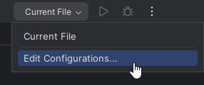
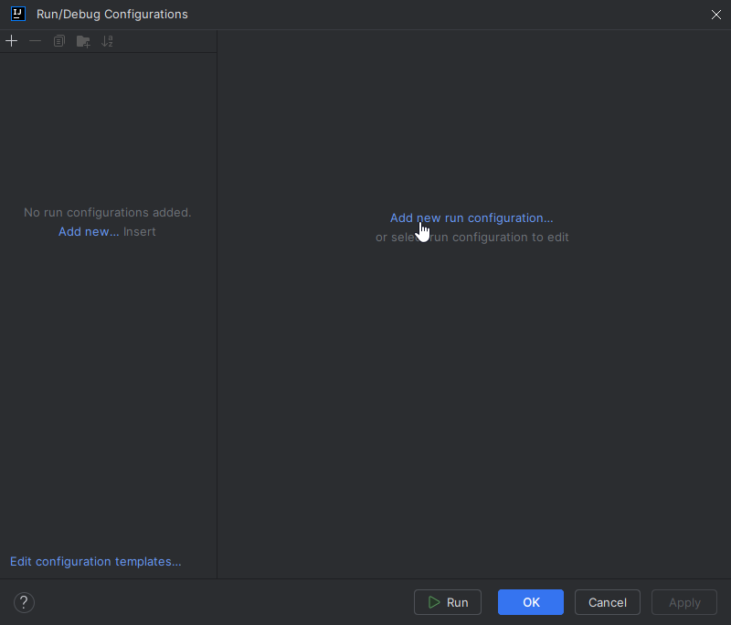
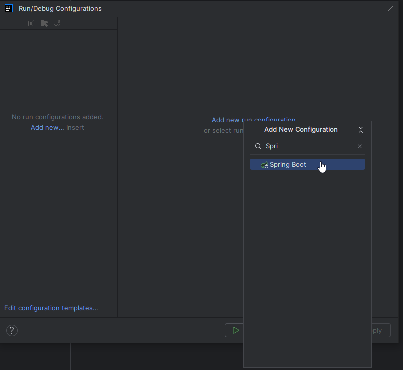
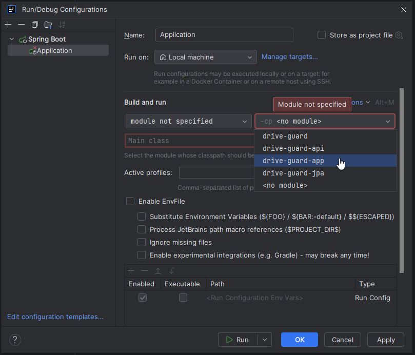
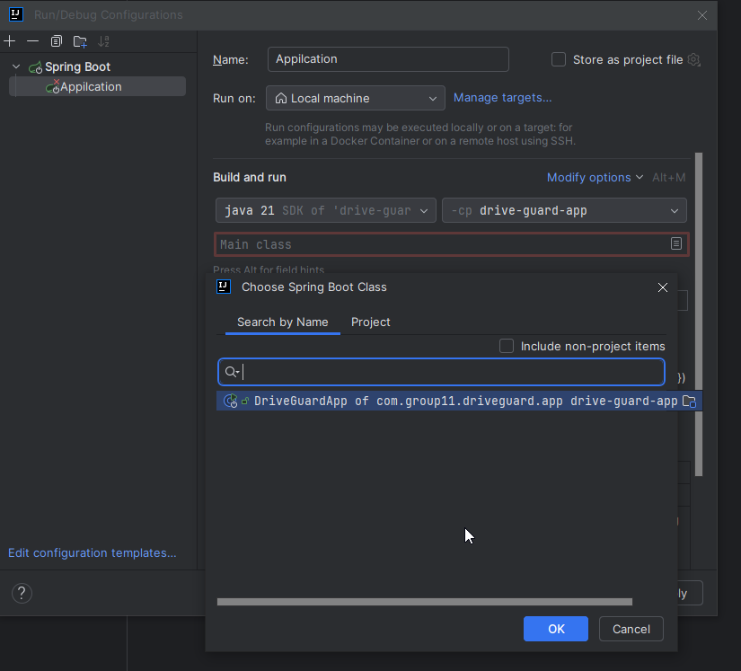
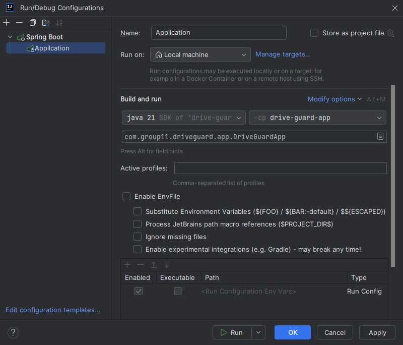
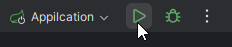
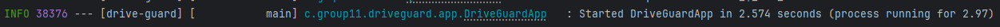

At the top there is a dropdown near the run button

Add a new config

Search for and add spring boot

Set the module to app

Select the main class

Now you should have something like this. You can change the name if you want it doesn't matter.

Apply and hit okay. Now you can run it!

If you configured everything right the application should start and get to this point "Started DriveGuardApp".

